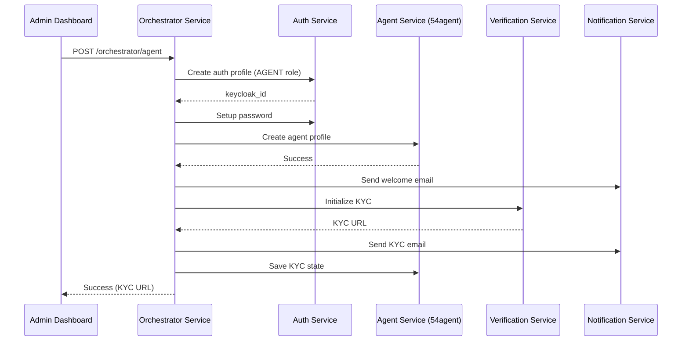

# Agent Creation Workflow - Orchestrator Service

## Overview

This document describes the implementation of the agent creation workflow in the orchestrator service. The workflow is similar to customer and admin creation workflows but interacts with the agent service in the **54agent namespace** (Agency Banking Platform).

## Architecture

### Service Communication

```
Admin Dashboard (54agent_agent_banking/uis/admin-dashboard)
    ↓
Orchestrator Service (/orchestrator/agent endpoint)
    ↓
Agent Service (agent.54agent.upi.dev)
```

The orchestrator service acts as the workflow coordinator, managing the multi-step process of creating an agent while interacting with various microservices:

- **Auth Service** - Creates Keycloak authentication profile
- **Agent Service** (54agent namespace) - Stores agent profile and business details
- **Verification Service** - Initializes KYC verification
- **Notification Service** - Sends welcome and KYC emails

## Implementation Files

### 1. Types Definition

**File**: `src/types/agent.d.ts`

```typescript
export interface IAgentProfilePayload {
  first_name: string;
  last_name: string;
  email: string;
  phone: string;
  uin: string;
  keycloak_id: string;
  tenant_id: string;
  agent_role?: string;
  business_name?: string;
  business_address?: string;
  city?: string;
  state?: string;
  postal_code?: string;
  lga?: string;
}
```

**File**: `src/types/workflows.d.ts`

Added `ICreateAgentWorkflow` interface with all required and optional fields for agent creation.

### 2. Agent Service Client

**File**: `src/services/agentService.ts`

HTTP client that communicates with the agent service in the 54agent namespace:

```typescript
class AgentService {
  private _axiosInstance: AxiosInstance;

  constructor() {
    this._axiosInstance = axios.create({
      baseURL: readEnv("AGENT_SVC_URL"), // https://agent.54agent.upi.dev
      headers: { "content-type": "application/json" },
    });
  }

  // Methods:
  // - createAgentProfile()
  // - saveAgentKycState()
  // - markKycComplete()
}
```

### 3. Workflow Activities

**Location**: `src/activities/agent/`

Three activity functions that wrap the agent service calls:

- **createAgentProfile.ts** - Creates agent profile in agent service
- **saveAgentKycState.ts** - Saves KYC URL for agent
- **markAgentKycComplete.ts** - Marks KYC as complete

### 4. Agent Creation Workflow

**File**: `src/workflows/createAgentWorkflow.ts`

Temporal workflow that orchestrates the agent creation process:

```typescript
export async function createAgentWorkflow(
  args: ICreateAgentWorkflow,
): Promise<string>;
```

**Workflow Steps**:

1. **Create Auth Profile** - Creates Keycloak user with AGENT role
2. **Setup Password** - Sets initial password for agent
3. **Create Agent Profile** - Creates agent record in agent service (54agent namespace)
4. **Send Welcome Email** - Sends welcome notification
5. **Initialize KYC** - Starts KYC verification process
6. **Send KYC Email** - Sends KYC link to agent
7. **Save KYC State** - Stores KYC URL in agent service

**Note**: Account creation happens after KYC completion via the `completeAgentOnboardingWorkflow`.

### 5. Controller & Route

**File**: `src/controllers/agent/postCreateAgent.ts`

Handles POST requests to create agents:

```typescript
export const postCreateAgent = asyncHandler(async (req, res) => {
  const payload = validateRequest(CreateAgentSchema, req.body);
  const tenantId = req.headers["x-tenant-id"];

  // Runs workflow with timeout handling
  const verification = await workflowRunner(createAgentWorkflow, {
    args: { ...payload, tenantId, keycloakRealm, keycloakPublicKey },
    workflowId: `54agent_create_agent_${tenantId}_${uuid4()}`,
    withTimeOut: 40000,
  });

  return res
    .status(httpStatus.CREATED)
    .json({ message: "success", verification });
});
```

**File**: `src/routes/agentRoute.ts`

Defines the `/agent` route:

```typescript
router.route("/").post(postCreateAgent);
```

### 6. Validation Schema

**File**: `src/validations/schemas.ts`

Added `CreateAgentSchema` for request validation:

```typescript
export const CreateAgentSchema = z.object({
  email: z.string().email(),
  firstName: z.string(),
  lastName: z.string(),
  phone: z.string(),
  uin: z.string(),
  password: z.string(),
  agentRole: z.string().optional(),
  businessName: z.string().optional(),
  businessAddress: z.string().optional(),
  city: z.string().optional(),
  state: z.string().optional(),
  postalCode: z.string().optional(),
  lga: z.string().optional(),
});
```

## Configuration

### Environment Variables

**File**: `.env.example`

Added the following configuration:

```bash
# Agent Service URL (54agent namespace)
AGENT_SVC_URL=https://agent.54agent.upi.dev
```

### Enum Updates

**File**: `src/utils/enums.ts`

Added AGENT to CustomerRole enum:

```typescript
export enum CustomerRole {
  SUPERADMIN = "superadmin",
  ADMIN = "admin",
  AGENT = "agent", // 👈 New
  USER = "user",
  GUEST = "guest",
}
```

## API Endpoint

### Create Agent

**Endpoint**: `POST /orchestrator/agent`

**Headers**:

```
Content-Type: application/json
x-tenant-id: {tenant_id}
```

**Request Body**:

```json
{
  "email": "agent@example.com",
  "firstName": "John",
  "lastName": "Doe",
  "phone": "+2348012345678",
  "uin": "12345678901",
  "password": "SecurePass123!",
  "agentRole": "agent",
  "businessName": "John's Agency",
  "businessAddress": "123 Main Street",
  "city": "Lagos",
  "state": "Lagos",
  "postalCode": "100001",
  "lga": "Ikeja"
}
```

**Success Response** (201):

```json
{
  "message": "success",
  "verification": "https://verify.example.com/kyc/abc123"
}
```

**Timeout Response** (202):

```json
{
  "isSuccessful": true,
  "message": "Agent creation processing... You'll be notified when it's done.",
  "responseModel": {}
}
```

## Integration with Admin Dashboard

The admin dashboard (54agent_agent_banking/uis/admin-dashboard) already has the frontend implementation:

**File**: `src/utils/api.ts`

```typescript
// Create an agent via Temporal workflow
createAgent: (data: CreateAgentPayload) =>
  request("/orchestrator/agent", {
    method: "POST",
    headers: fullHeaders(),
    body: JSON.stringify(data),
  });
```

With the multi-namespace routing:

- `/orchestrator/agent` → `https://54agent.upi.dev/orchestrator/agent` (Orchestrator)
- Agent service calls → `https://agent.54agent.upi.dev` (Agent Service)

## Workflow Execution Flow



## Testing

### Local Development

1. **Set environment variable**:

   ```bash
   export AGENT_SVC_URL=https://agent.54agent.upi.dev
   ```

2. **Start the orchestrator service**:

   ```bash
   npm run dev
   ```

3. **Test the endpoint**:
   ```bash
   curl -X POST http://localhost:8080/orchestrator/agent \
     -H "Content-Type: application/json" \
     -H "x-tenant-id: bpmgd" \
     -d '{
       "email": "test-agent@example.com",
       "firstName": "Test",
       "lastName": "Agent",
       "phone": "+2348012345678",
       "uin": "12345678901",
       "password": "TestPassword123!",
       "agentRole": "agent",
       "businessName": "Test Agency"
     }'
   ```

### Temporal Workflow Monitoring

Monitor workflow execution in Temporal UI:

- Workflow ID: `54agent_create_agent_{tenant_id}_{uuid}`
- Task Queue: From `TEMPORAL_TASK_QUEUE` env var
- Namespace: From `TEMPORAL_NAMESPACE` env var

## Error Handling

The workflow includes:

1. **Retry Policy**:
   - Initial interval: 1s
   - Maximum interval: 1m
   - Backoff coefficient: 2
   - Maximum attempts: 3

2. **Timeout Handling**:
   - Workflow timeout: 40s
   - Returns 202 Accepted if timeout occurs
   - Workflow continues in background

3. **Activity Timeouts**:
   - Start-to-close timeout: 1m per activity

## Differences from Admin/Customer Workflows

| Feature               | Customer     | Admin         | Agent                                         |
| --------------------- | ------------ | ------------- | --------------------------------------------- |
| **Service Namespace** | 54agent       | 54agent        | **54agent**                                   |
| **User Role**         | USER         | ADMIN         | **AGENT**                                     |
| **Service URL**       | user-service | admin-service | **agent.54agent**                             |
| **Business Fields**   | Address only | None          | **Business name, address, LGA**               |
| **Special Metadata**  | None         | is_admin flag | **Agent role (agent/super_agent/aggregator)** |
| **Account Creation**  | After KYC    | After KYC     | **After KYC (via completeAgentOnboarding)**   |

## Account Creation After KYC

Similar to customer workflow, agent account creation happens automatically after KYC completion:

1. **KYC Completion** - Verification service completes verification
2. **KYC Callback** - Calls `POST /orchestrator/agent/kyc/callback`
3. **Complete Agent Onboarding Workflow** - Triggered automatically:
   - Creates account in account-service
   - Marks KYC as complete in agent-service
   - Account becomes available for transactions

**Files**:

- `src/workflows/completeAgentOnboardingWorkflow.ts` - Account creation workflow
- `src/activities/agent/createAgentAccountProfile.ts` - Account creation activity
- `src/controllers/agent/postAgentKycCallback.ts` - KYC callback handler
- `src/routes/agentRoute.ts` - Agent routes including KYC callback

## Benefits

1. **Namespace Isolation**: Agent service runs in separate 54agent namespace
2. **Consistent Pattern**: Follows same workflow pattern as admin/customer
3. **Scalability**: Agents can be managed independently from core banking
4. **Flexibility**: Supports different agent roles and business details
5. **Unified Interface**: Admin dashboard provides single interface for all user types

## Future Enhancements

1. **Agent Approval Workflow**: Add admin approval step before activation
2. **Float Management**: Initialize agent float account during creation
3. **Commission Setup**: Configure commission rates during onboarding
4. **Device Assignment**: Link POS terminals to agent during creation
5. **Compliance Checks**: Additional compliance validation for agents

## Related Documentation

- [Multi-Namespace API Routing](../../../54agent_agent_banking/uis/admin-dashboard/MULTI_NAMESPACE_API_README.md)
- [Tenant Management](../../../54agent_agent_banking/uis/admin-dashboard/TENANT_MANAGEMENT_README.md)
